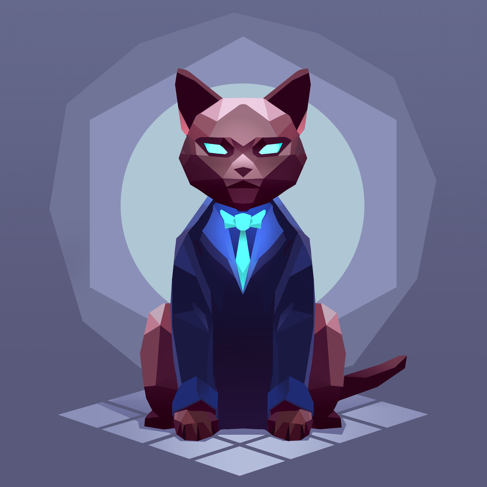

## About 0xScourgedev
0xScourgedev serves as the CEO and Lead Fuzzing Specialist at Perimeter, bringing extensive experience in performing fuzzing engagements for some of the largest DeFi protocols, including [Pendle](https://www.pendle.finance), [Synthetix](https://synthetix.io) and various other protocols.

Previously, he held the role of a technical Team Lead of over 10 developers at a successful blockchain startup. He also contributed to the development of smart contracts for large scale projects such as [Parallel TCG](https://parallel.life).

## Testimonials

> I engaged 0xScourgedev for fuzz testing on behalf of Pendle, and I was impressed with his dedication and willingness to go above and beyond. He was very responsive and committed to delivering quality results, consistently addressing any queries or concerns promptly. Overall, 0xScourgedev did a great job ensuring the robustness of the contract. We look forward to working with him again in the future.
> - [Long Vuong](https://x.com/unclegrandpa925), [Pendle](https://www.pendle.finance), [Link to testimonial](https://x.com/0xScourgedev/status/1801298332947517713)

> @Immutable recently engaged @perimeter_sec to create fuzzing harnesses and test our L1 bridge contracts. We were really impressed with the team's professionalism and high quality report 🙏 @0xScourgedev @rappie
> - [audityourcontracts](https://x.com/AuditUrContract), [Immutable](https://www.immutable.com), [Link to testimonial](https://x.com/AuditUrContract/status/1844180704483213505)

> Huge thanks to @0xScourgedev for the @MIMSwap Fuzzing tool created during our audit with @GuardianAudits
> Give us more confidence moving forward with the product. Awesome suite!
> https://github.com/Abracadabra-money/abracadabra-money-contracts/tree/main/test/fuzzing
> - [0xCalibur](https://x.com/0xCaliburSpell), [Abracadabra](https://abracadabra.money), [Link to testimonial](https://x.com/0xCaliburSpell/status/1778784355470496000)

## External Links
- X (Formerly Twitter): [@0xScourgedev](https://x.com/0xScourgedev)
- Telegram: [@scourgedev](https://t.me/scourgedev)
- Discord: [0xscourgedev](https://discord.com/users/1016424203366449152)
- [Github portfolio](https://github.com/ljz3/portfolio)